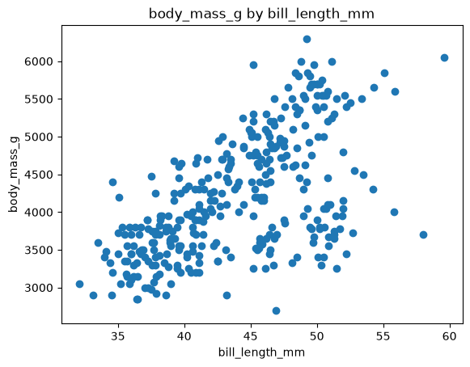

# Project Documentation

> Use this hosted documentation site to tell your
> data story. Include a narrative telling your
> results, observations, and interpretations.
> Display visuals as needed for a compelling story.

## Professional Workflow

See [**Workflow B: Apply Example Project**](https://denisecase.github.io/pro-analytics-02/workflow-b-apply-example-project/)
to get a project like this running on your machine.

## Professional Projects

- We code like the pros to help us **focus on the analytics**.
- Most files in this repository will never be touched.
- If curious about a file, check out the
  [Professional Python Project Explainer](https://denisecase.github.io/professional-python-project-explainer/).

## Documentation Index

- **Home** - this landing page
- [**Project Instructions**](./project-instructions.md)
- [**Concepts**](./concepts.md)
- [**Data Card**](./data-card.md)
- [**API**](./api.md)

## Initial Results

The code generates a scatter plot showing
the relationship between two selected columns.

